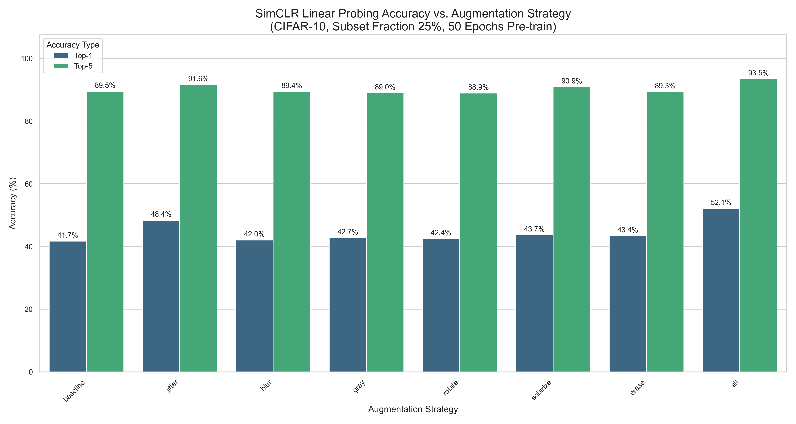
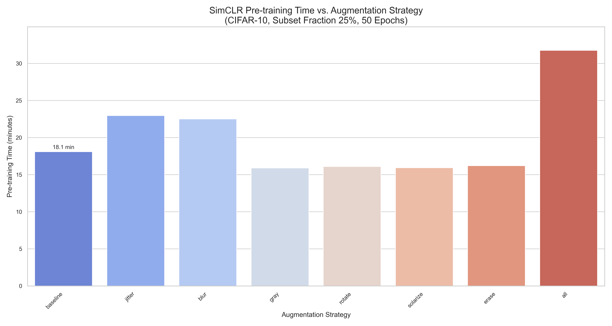
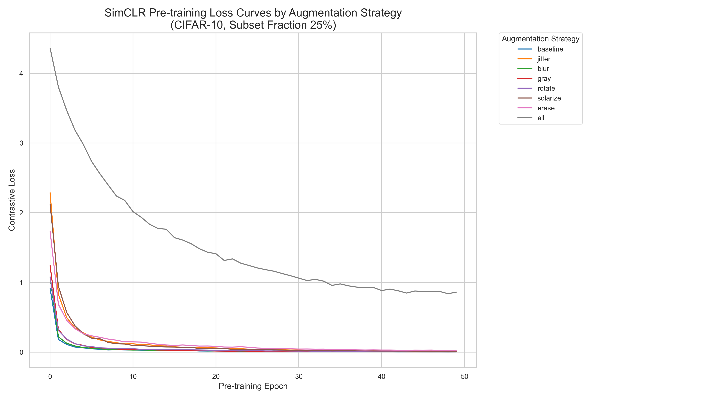
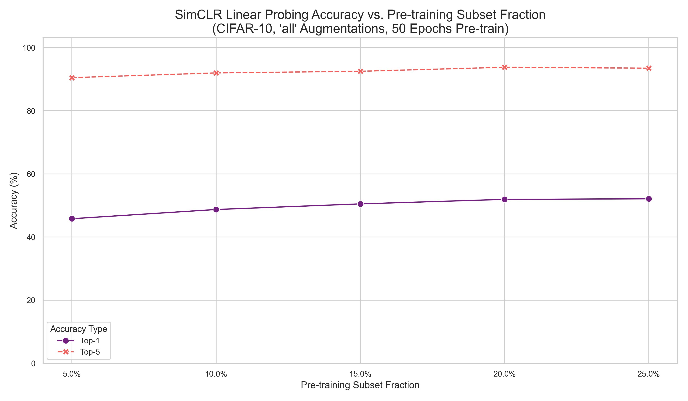
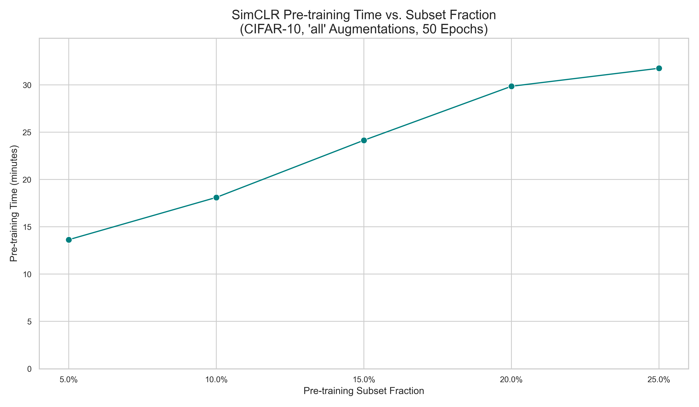
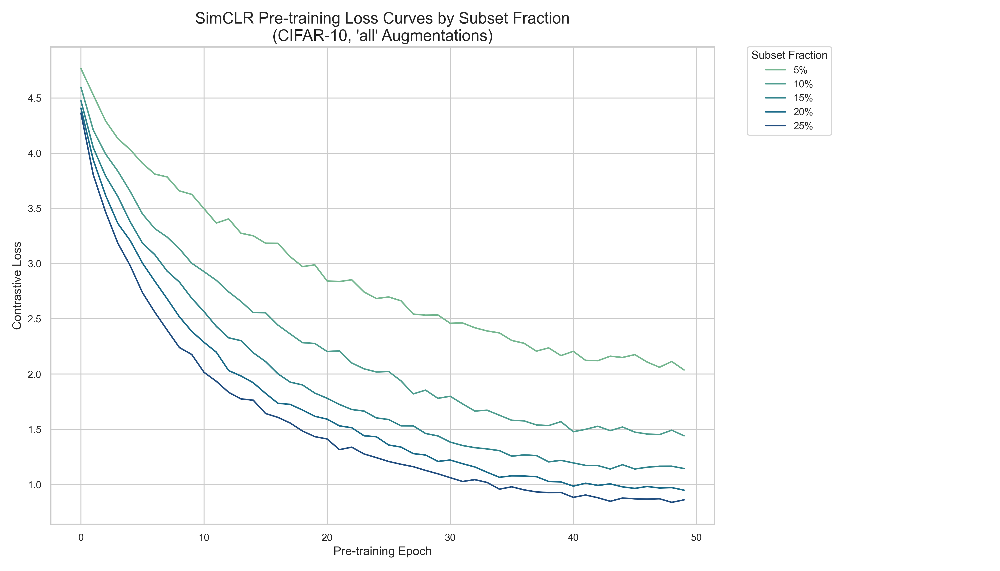

# 🔬 SimCLR (Enhanced for Augmentation Analysis on CIFAR-10)

This repository builds on the original SimCLR framework by [sthalles](https://github.com/sthalles/SimCLR) and includes extended functionality for:

- Training on **subsets of CIFAR-10** (e.g., 25%, 50%)
- Fine-grained control over **data augmentations**
- Built-in **linear evaluation** (Top-1 / Top-5 accuracy)
- Centralized CSV logging for loss and accuracy
- Visual tools for inspecting augmentations
- Comparative analysis plots for different experimental setups

---
## 📁 Repository Structure

```

SimCLR/  
├── run.py # Main training + linear evaluation script  
├── run_all_py.py # Run predefined experiment sets automatically  
├── analyze_results.py # Analyze CSV results and generate plots  
├── visualize_augs_cifar10.py # Visualize CIFAR-10 augmentations  
├── visualize_augs_stl10.py # Visualize STL-10 augmentations  
├── simclr.py # Core SimCLR pipeline logic  
├── evaluation.py # Linear probing implementation  
├── utils.py # Logging helpers (CSV, config, etc.)  
├── models/  
│ └── resnet_simclr.py # ResNet backbone  
├── data_aug/  
│ └── contrastive_learning_dataset.py # Dataset + augmentation wrapper  
├── runs/ # Auto-generated logs and checkpoints per run  
├── analysis_plots/ # Stores generated result plots  
├── simclr_loss_results.csv # Logs SimCLR training loss across runs  
├── linear_probing_accuracy_results.csv # Logs final evaluation results  
├── requirements.txt  
├── README.md

```

---
## ⚙️ Main Features

### 🔹 Dataset Subsetting
- Use `--subset_fraction` to train on a specific portion of CIFAR-10
- Built using `torch.utils.data.Subset`

### 🔹 Modular Augmentation Pipeline
- Augmentations can be selected via the `--augmentations` flag:
  - Options: `jitter`, `blur`, `gray`, `rotate`, `solarize`, `erase`
- Augmentations apply on top of a **baseline**:
  - `RandomCrop(32, padding=4)` + `RandomHorizontalFlip(p=0.5)`
- Examples:
  ```bash
  --augmentations baseline
  --augmentations blur,jitter
  --augmentations all


### 🔹 Logging and Evaluation

- Each run has a unique `run_id` with logs in `runs/<run_id>/`
- Stores `config.yml`, `training.log`, checkpoint, and TensorBoard
- Results logged in:
    - `simclr_loss_results.csv` — Epoch-wise training loss
    - `linear_probing_accuracy_results.csv` — Final accuracy, timing, etc.

---

## 🖼️ Data Augmentation (CIFAR-10 Visualization)

| Original                                       | Augmentations                                     |
| ---------------------------------------------- | ------------------------------------------------- |
|  |  |

_Visualized using `visualize_augs_cifar10.py`_

---
## 📊 Experimental Results

Experiments are grouped into two sets:
- **Experiment 1**: Compare different augmentations (fixed 25% subset)
- **Experiment 2**: Compare subset sizes using `all` augmentations

### 🔹 Experiment 1: Augmentations @ 25% Subset

| Accuracy Comparison                                      | Pre-training Time                                             | Loss Curve                                                  |
| -------------------------------------------------------- | ------------------------------------------------------------- | ----------------------------------------------------------- |
|  |  |  |


### 🔹 Experiment 2: Subset Size Comparison (with `all` augmentations)

| Accuracy vs Subset                                          | Time vs Subset                                                   | Loss Curve                                                     |
| ----------------------------------------------------------- | ---------------------------------------------------------------- | -------------------------------------------------------------- |
|  |  |  |

_Generated using `analyze_results.py`_

---
## 🚀 Getting Started

### ✅ Install Requirements

```bash
pip install -r requirements.txt
```

---
### ✅ Example Command

```bash
python run.py --arch resnet18 --augmentations blur,jitter --subset_fraction 0.25 --epochs 50
```

Or run the full experiment suite:

```bash
python run_all_py.py
```

---
## 🧪 CLI Argument Overview

|Category|Flag|Description|
|---|---|---|
|Dataset|`--dataset-name`|`cifar10` or `stl10`|
||`--subset_fraction`|Portion of data to use (e.g., 0.25)|
|Augmentations|`--augmentations`|List like `blur,jitter,erase`, or `all`|
|Model|`--arch`|`resnet18` or `resnet50`|
|Training|`--epochs`|Number of pretrain epochs|
||`--batch-size`|Batch size|
||`--learning-rate` / `--lr`|Initial LR|
||`--fp16-precision`|Enable mixed precision|
|Evaluation|`--run_linear_eval` / `--no_linear_eval`|Enable/disable linear eval|
|Misc|`--gpu-index`, `--log-every-n-steps`, `--seed`, `--disable-cuda`|Misc settings|

---
## 📦 Outputs

- `runs/<run_id>/` — All run logs and model artifacts
- `simclr_loss_results.csv` — Logs SimCLR loss (all runs)
- `linear_probing_accuracy_results.csv` — Logs Top-1 / Top-5 accuracy
- `analysis_plots/` — Final visualizations for result comparison

---
## 🤝 Credits

Originally based on:

- [sthalles/SimCLR](https://github.com/sthalles/SimCLR)

Maintained by **Ahmad Nayfeh** for research on augmentation effects in self-supervised learning — EE-663 (Digital Image Processing), KFUPM.